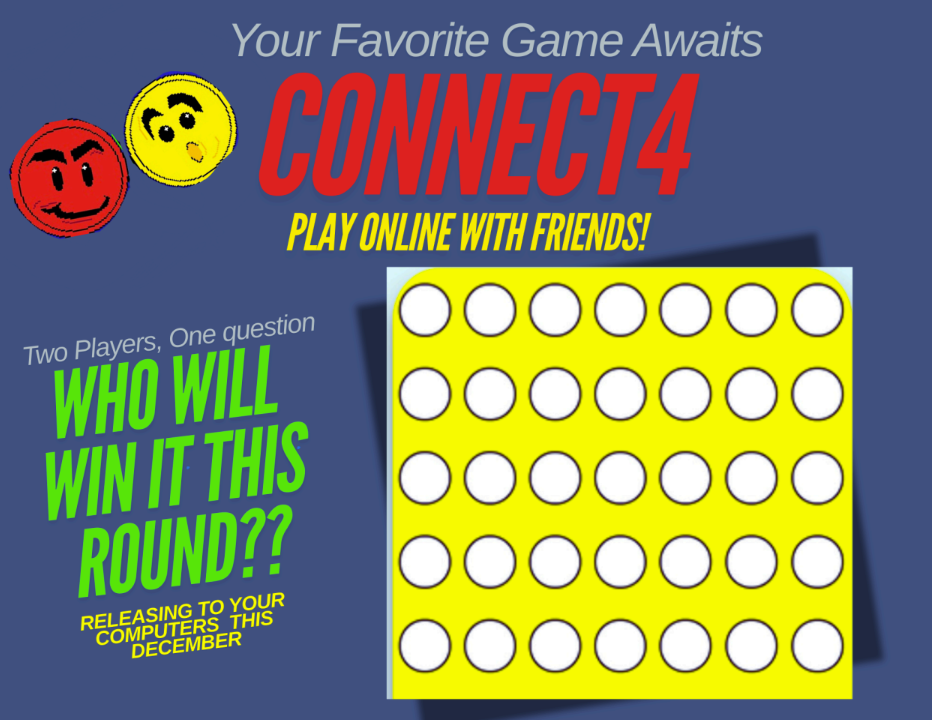
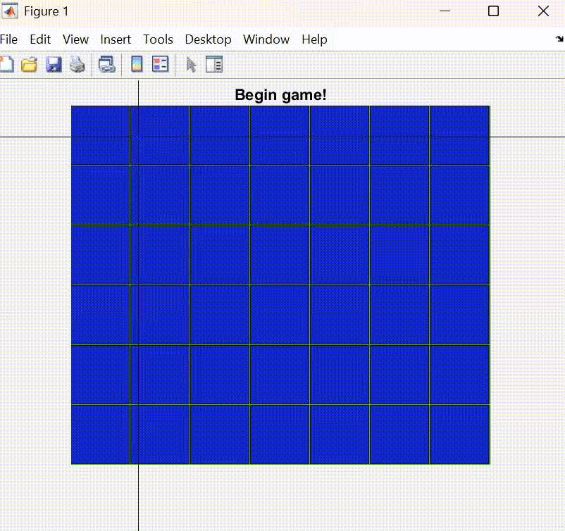

<h1 align="center">Connect Four🔴🟡</h1>

###

  

###

<h3 align="left">How to Play</h3>

###

1. Download the files above 2. Upload files into the same folder in Matlab 3. Run FinalConnect4.m 4. Alternate turns with another player and first to four in a row wins!

###

  

###

<h3 align="left">🎮 Software Design Project – ENGR 1181</h3>

###

This game was developed as the final software design project for ENGR 1181: Fundamentals of Engineering I at The Ohio State University.

###

<h4 align="left">👥 Team Members</h4>

###

- Kaylin Kerrick  - Susmita Adhikari  - Qibo Li  - Daehee Kim  Together, we collaborated on all aspects of the project, including planning, design, implementation, and testing.

###
